# Tasfia's - U of T ECE444 PRA3 TDD & Deployment

This repository is adapted from https://github.com/shuruizUofT/flaskr-tdd and this link is a modified version of the [upstream project](https://github.com/mjhea0/flaskr-tdd).

### Summary of updates:
- Replace Heroku with Render (2024-Sep)

# Flaskr - Intro to Flask, Test-Driven Development, and JavaScript

## What you're building

You'll be building a simple blogging app in this tutorial:

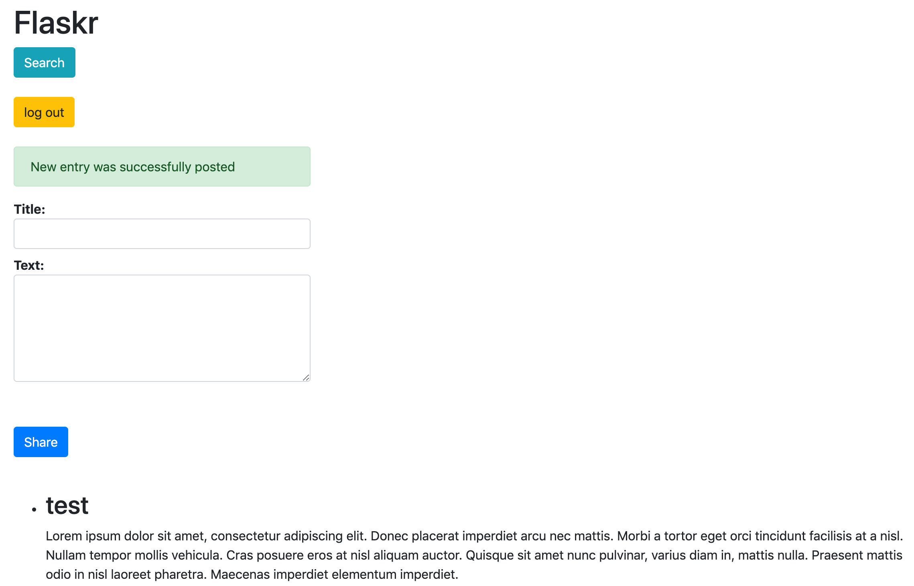

## Contents
1. [Project Setup](#project-setup)
1. [First Test](#first-test)
1. [Database Setup](#database-setup)
1. [Templates and Views](#templates-and-views)
1. [Add Some Style](#add-some-style)
1. [JavaScript](#javascript)
1. [Deployment](#deployment)
1. [Bootstrap](#bootstrap)
1. [SQLAlchemy](#sqlalchemy)
1. [Search Page](#search-page)
1. [Login Required](#login-required)
1. [Postgres Render](#Postgres-Database-on-Render)
1. [Linting and Code Formatting](#linting-and-code-formatting)
1. [Conclusion](#conclusion)

## Requirements

This tutorial utilizes the following requirements:

1. Python
1. Flask
1. Flask-SQLAlchemy
1. [Gunicorn](https://gunicorn.org/) (a production-grade WSGI web server)
1. [Psycopg2](https://pypi.org/project/psycopg2/) (a Postgres database adapter for Python)
1. Flake8
1. Black
1. pytest

## Project Setup

Create a new directory to store the project:

```sh
$ mkdir flaskr-tdd
$ cd flaskr-tdd
```

Create and activate a virtual environment:

```sh
$ python3 -m venv env
$ source env/bin/activate
(env)$
```

> You know that you're in a virtual environment when `env` is displayed before the `$` in your terminal: `(env)$`. To exit the virtual environment, use the command `deactivate`. You can reactivate by navigating back to the project directory and running `source env/bin/activate`.

Install Flask with pip:

```sh
(env)$ pip install flask
```

## First Test

Let's start with a simple "hello, world" app.

Create the following files and folders:

```sh
├── project
│   ├── __init__.py
│   ├── app.py
└── tests
    ├── __init__.py
    └── app_test.py
```
### pytest
[pytest](https://pytest.org/) is the go-to testing framework for testing Python code. For more on pytest, check out [Pytest for Beginners](https://testdriven.io/blog/pytest-for-beginners/).

Install it:

```sh
(env)$ pip install pytest
```

Open *tests/app_test.py* in your favorite text editor -- like [Visual Studio Code](https://code.visualstudio.com/), [Sublime Text](https://www.sublimetext.com/), or [PyCharm](https://www.jetbrains.com/pycharm/) -- and then add the following code:

```python
from project.app import app


def test_index():
    tester = app.test_client()
    response = tester.get("/", content_type="html/text")

    assert response.status_code == 200
    assert response.data == b"Hello, World!"
```

Essentially, we're testing whether the response that we get back has a status code of "200" and that "Hello, World!" is displayed.

Run the test:

```sh
(env)$ python -m pytest
```

If all goes well, this test will fail:

```sh
ImportError: cannot import name 'app' from 'project.app
```

Now add the code for this to pass to *project/app.py*:

```python
from flask import Flask


# create and initialize a new Flask app
app = Flask(__name__)


@app.route("/")
def hello():
    return "Hello, World!"


if __name__ == "__main__":
    app.run()
```

Run the app:

```sh
(env)$ FLASK_APP=project/app.py python -m flask run -p 5001
```

> The `FLASK_APP` environment variable is used to tell Flask to look for the application in a different module.

Then, navigate to [http://localhost:5001/](http://localhost:5001/) in your browser of choice. You should see "Hello, World!" on your screen.

Return to the terminal. Kill the server with Ctrl+C.

Run the test again:

```sh
(env)$ python -m pytest

=============================== test session starts ===============================
platform darwin -- Python 3.10.4, pytest-7.4.2, pluggy-1.0.0
rootdir: /Users/michael/repos/github/flaskr-tdd
collected 1 item

tests/app_test.py .                                                         [100%]

================================ 1 passed in 0.10s ================================
```

Nice.

## Database Setup

Essentially, we want to open a database connection, create the database based on a defined schema if it doesn't already exist, and then close the connection each time a test is ran.

Create a new file called *schema.sql* in "project" and add the following code:

```sql
drop table if exists entries;

create table entries (
  id integer primary key autoincrement,
  title text not null,
  text text not null
);
```

This will set up a single table with three fields: "id", "title", and "text". SQLite will be used for our RDMS since it's part of the standard Python library and requires no configuration.

Update *app.py*:

```python
from flask import Flask


# configuration
DATABASE = "flaskr.db"

# create and initialize a new Flask app
app = Flask(__name__)

# load the config
app.config.from_object(__name__)


@app.route("/")
def hello():
    return "Hello, World!"


if __name__ == "__main__":
    app.run()
```

Here, we created a configuration section for config variables (with the name of the future SQLite database) and loaded the config after app initialization.

How do we test for the existence of a file? Update *app_test.py* like so:

```python
from pathlib import Path

from project.app import app


def test_index():
    tester = app.test_client()
    response = tester.get("/", content_type="html/text")

    assert response.status_code == 200
    assert response.data == b"Hello, World!"


def test_database():
    assert Path("flaskr.db").is_file()
```

Run it to make sure it fails, indicating that the database does not exist.

Now add the following code to *app.py*, just before the `hello` view function:

```python
# connect to database
def connect_db():
    """Connects to the database."""
    rv = sqlite3.connect(app.config["DATABASE"])
    rv.row_factory = sqlite3.Row
    return rv


# create the database
def init_db():
    with app.app_context():
        db = get_db()
        with app.open_resource("schema.sql", mode="r") as f:
            db.cursor().executescript(f.read())
        db.commit()


# open database connection
def get_db():
    if not hasattr(g, "sqlite_db"):
        g.sqlite_db = connect_db()
    return g.sqlite_db


# close database connection
@app.teardown_appcontext
def close_db(error):
    if hasattr(g, "sqlite_db"):
        g.sqlite_db.close()
```

Add the imports:

```python
import sqlite3

from flask import Flask, g
```

> Curious about `g` object? Check out the [Understanding the Application and Request Contexts in Flask](https://testdriven.io/blog/flask-contexts/) for more.

You should now have:

```python
import sqlite3

from flask import Flask, g


# configuration
DATABASE = "flaskr.db"

# create and initialize a new Flask app
app = Flask(__name__)

# load the config
app.config.from_object(__name__)


# connect to database
def connect_db():
    """Connects to the database."""
    rv = sqlite3.connect(app.config["DATABASE"])
    rv.row_factory = sqlite3.Row
    return rv


# create the database
def init_db():
    with app.app_context():
        db = get_db()
        with app.open_resource("schema.sql", mode="r") as f:
            db.cursor().executescript(f.read())
        db.commit()


# open database connection
def get_db():
    if not hasattr(g, "sqlite_db"):
        g.sqlite_db = connect_db()
    return g.sqlite_db


# close database connection
@app.teardown_appcontext
def close_db(error):
    if hasattr(g, "sqlite_db"):
        g.sqlite_db.close()


@app.route("/")
def hello():
    return "Hello, World!"


if __name__ == "__main__":
    app.run()
```

Now, create a database by starting up a Python shell and importing and then calling the `init_db` function:

```python
>>> from project.app import init_db
>>> init_db()
```

Close the shell, then run the test again. Does it pass? It should. Now we know that the database has been created.

You can also call `init_db` within the test, to ensure that the test can be ran independently:

```python
from pathlib import Path

from project.app import app, init_db


def test_index():
    tester = app.test_client()
    response = tester.get("/", content_type="html/text")

    assert response.status_code == 200
    assert response.data == b"Hello, World!"


def test_database():
    init_db()
    assert Path("flaskr.db").is_file()
```

Updated structure:

```sh
├── flaskr.db
├── project
│   ├── __init__.py
│   ├── app.py
│   └── schema.sql
└── tests
    ├── __init__.py
    └── app_test.py
```

## Templates and Views

Next, we need to set up the templates and the associated views, which define the routes. Think about this from a user's standpoint:

1. Users should be able to log in and out.
1. Once logged in, users should be able to post new messages.
1. Finally, users should be able to view the messages.

Write some tests for this first.

### Tests

Take a look at the final code below. I added docstrings for explanation.

```python
import os
import pytest
from pathlib import Path

from project.app import app, init_db

TEST_DB = "test.db"


@pytest.fixture
def client():
    BASE_DIR = Path(__file__).resolve().parent.parent
    app.config["TESTING"] = True
    app.config["DATABASE"] = BASE_DIR.joinpath(TEST_DB)

    init_db() # setup
    yield app.test_client() # tests run here
    init_db() # teardown


def login(client, username, password):
    """Login helper function"""
    return client.post(
        "/login",
        data=dict(username=username, password=password),
        follow_redirects=True,
    )


def logout(client):
    """Logout helper function"""
    return client.get("/logout", follow_redirects=True)


def test_index(client):
    response = client.get("/", content_type="html/text")
    assert response.status_code == 200


def test_database(client):
    """initial test. ensure that the database exists"""
    tester = Path("test.db").is_file()
    assert tester


def test_empty_db(client):
    """Ensure database is blank"""
    rv = client.get("/")
    assert b"No entries yet. Add some!" in rv.data


def test_login_logout(client):
    """Test login and logout using helper functions"""
    rv = login(client, app.config["USERNAME"], app.config["PASSWORD"])
    assert b"You were logged in" in rv.data
    rv = logout(client)
    assert b"You were logged out" in rv.data
    rv = login(client, app.config["USERNAME"] + "x", app.config["PASSWORD"])
    assert b"Invalid username" in rv.data
    rv = login(client, app.config["USERNAME"], app.config["PASSWORD"] + "x")
    assert b"Invalid password" in rv.data


def test_messages(client):
    """Ensure that user can post messages"""
    login(client, app.config["USERNAME"], app.config["PASSWORD"])
    rv = client.post(
        "/add",
        data=dict(title="<Hello>", text="<strong>HTML</strong> allowed here"),
        follow_redirects=True,
    )
    assert b"No entries here so far" not in rv.data
    assert b"&lt;Hello&gt;" in rv.data
    assert b"<strong>HTML</strong> allowed here" in rv.data
```

Take note of the `client` function. This is a pytest [fixture](https://docs.pytest.org/en/stable/fixture.html), which sets up a known state for each test function before the test runs.

Run the tests now:

```sh
(env)$ python -m pytest
```

Three tests should fail:

```sh
=============================== test session starts ===============================
platform darwin -- Python 3.10.4, pytest-7.4.2, pluggy-1.0.0
rootdir: /Users/michael/repos/github/flaskr-tdd
collected 5 items

tests/app_test.py ..FFF                                                     [100%]

==================================== FAILURES =====================================
__________________________________ test_empty_db __________________________________

client = <FlaskClient <Flask 'project.app'>>

    def test_empty_db(client):
        """Ensure database is blank"""
        rv = client.get("/")
>       assert b"No entries yet. Add some!" in rv.data
E       AssertionError: assert b'No entries yet. Add some!' in b'Hello, World!'
E        +  where b'Hello, World!' = <WrapperTestResponse 13 bytes [200 OK]>.data

tests/app_test.py:49: AssertionError
________________________________ test_login_logout ________________________________

client = <FlaskClient <Flask 'project.app'>>

    def test_login_logout(client):
        """Test login and logout using helper functions"""
>       rv = login(client, app.config["USERNAME"], app.config["PASSWORD"])
E       KeyError: 'USERNAME'

tests/app_test.py:54: KeyError
__________________________________ test_messages __________________________________

client = <FlaskClient <Flask 'project.app'>>

    def test_messages(client):
        """Ensure that user can post messages"""
>       login(client, app.config["USERNAME"], app.config["PASSWORD"])
E       KeyError: 'USERNAME'

tests/app_test.py:66: KeyError
============================= short test summary info =============================
FAILED tests/app_test.py::test_empty_db -
    AssertionError: assert b'No entries yet. Add some!' in b'Hello, World!'
FAILED tests/app_test.py::test_login_logout - KeyError: 'USERNAME'
FAILED tests/app_test.py::test_messages - KeyError: 'USERNAME'
=========================== 3 failed, 2 passed in 0.17s ==========================
```

Let's get these all green, one at a time...

### Show Entries

First, replace the `hello` view with the following view function for displaying the entries to *app.py*:

```python
@app.route('/')
def index():
    """Searches the database for entries, then displays them."""
    db = get_db()
    cur = db.execute('select * from entries order by id desc')
    entries = cur.fetchall()
    return render_template('index.html', entries=entries)
```

Import in `render_template`:

```python
from flask import Flask, g, render_template
```

Then, create a new folder called "templates" inside of "project", and add an *index.html* template file to it:

```html
<!DOCTYPE html>
<html>
  <head>
    <title>Flaskr</title>
    <link
      rel="stylesheet"
      type="text/css"
      href="{{ url_for('static', filename='style.css') }}"
    />
  </head>
  <body>
    <div class="page">
      <h1>Flaskr-TDD</h1>

      <div class="metanav">
        
        <a href="{{ url_for('login') }}">log in</a>
        
        <a href="{{ url_for('logout') }}">log out</a>
        
      </div>

      
      <div class="flash">{{ message }}</div>
        
      <form
        action="{{ url_for('add_entry') }}"
        method="post"
        class="add-entry"
      >
        <dl>
          <dt>Title:</dt>
          <dd><input type="text" size="30" name="title" /></dd>
          <dt>Text:</dt>
          <dd><textarea name="text" rows="5" cols="40"></textarea></dd>
          <dd><input type="submit" value="Share" /></dd>
        </dl>
      </form>
      

      <ul class="entries">
        
        <li>
          <h2>{{ entry.title }}</h2>
          {{ entry.text|safe }}
        </li>
        
        <li><em>No entries yet. Add some!</em></li>
        
      </ul>
    </div>
  </body>
</html>
```

### User Login and Logout

Update *app.py*:

```python
@app.route('/login', methods=['GET', 'POST'])
def login():
    """User login/authentication/session management."""
    error = None
    if request.method == 'POST':
        if request.form['username'] != app.config['USERNAME']:
            error = 'Invalid username'
        elif request.form['password'] != app.config['PASSWORD']:
            error = 'Invalid password'
        else:
            session['logged_in'] = True
            flash('You were logged in')
            return redirect(url_for('index'))
    return render_template('login.html', error=error)


@app.route('/logout')
def logout():
    """User logout/authentication/session management."""
    session.pop('logged_in', None)
    flash('You were logged out')
    return redirect(url_for('index'))
```

In the above `login` function, the decorator indicates that the route can accept either a GET or POST request. Put simply, a request is initiated by the end user when they access the `/login` URL. The difference between these requests is simple: GET is used for accessing a webpage, while POST is used when information is sent to the server. Thus, when a user accesses the `/login` URL, they are using a GET request, but when they attempt to log in, a POST request is used.

Update the config as well:

```python
# configuration
DATABASE = "flaskr.db"
USERNAME = "admin"
PASSWORD = "admin"
SECRET_KEY = "change_me"
```

Add the appropriate imports:

```python
from flask import Flask, g, render_template, request, session, flash, redirect, url_for
```

Add the *login.html* template:

```html
<!DOCTYPE html>
<html>
  <head>
    <title>Flaskr-TDD | Login</title>
    <link
      rel="stylesheet"
      type="text/css"
      href="{{ url_for('static', filename='style.css') }}"
    />
  </head>
  <body>
    <div class="page">
      <h1>Flaskr</h1>

      <div class="metanav">
        
        <a href="{{ url_for('login') }}">log in</a>
        
        <a href="{{ url_for('logout') }}">log out</a>
        
      </div>

      
      <div class="flash">{{ message }}</div>
       

      <h2>Login</h2>

      
      <p class="error"><strong>Error:</strong> {{ error }}</p>
      

      <form action="{{ url_for('login') }}" method="post">
        <dl>
          <dt>Username:</dt>
          <dd><input type="text" name="username" /></dd>
          <dt>Password:</dt>
          <dd><input type="password" name="password" /></dd>
          <dd><input type="submit" value="Login" /></dd>
        </dl>
      </form>
    </div>
  </body>
</html>
```

Run the tests again. You should see two errors:

```sh
E           werkzeug.routing.BuildError: Could not build url for endpoint 'add_entry'. Did you mean 'login' instead?
```

Next, add in a view for adding entries:

```python
@app.route('/add', methods=['POST'])
def add_entry():
    """Add new post to database."""
    if not session.get('logged_in'):
        abort(401)
    db = get_db()
    db.execute(
        'insert into entries (title, text) values (?, ?)',
        [request.form['title'], request.form['text']]
    )
    db.commit()
    flash('New entry was successfully posted')
    return redirect(url_for('index'))
```

Add the appropriate imports:

```python
from flask import Flask, g, render_template, request, session, flash, redirect, url_for, abort
```

Retest:

```sh
=============================== test session starts ===============================
platform darwin -- Python 3.10.4, pytest-7.4.2, pluggy-1.0.0
rootdir: /Users/michael/repos/github/flaskr-tdd
collected 5 items

tests/app_test.py .....                                                     [100%]

================================ 5 passed in 0.16s ================================
```

Perfect.

## Add Some Style

Save the following styles to a new file called *style.css* in a new folder called "project/static":

```css
body {
  font-family: sans-serif;
  background: #eee;
}

a,
h1,
h2 {
  color: #377ba8;
}

h1,
h2 {
  font-family: "Georgia", serif;
  margin: 0;
}

h1 {
  border-bottom: 2px solid #eee;
}

h2 {
  font-size: 1.2em;
}

.page {
  margin: 2em auto;
  width: 35em;
  border: 5px solid #ccc;
  padding: 0.8em;
  background: white;
}

.entries {
  list-style: none;
  margin: 0;
  padding: 0;
}

.entries li {
  margin: 0.8em 1.2em;
}

.entries li h2 {
  margin-left: -1em;
}

.add-entry {
  font-size: 0.9em;
  border-bottom: 1px solid #ccc;
}

.add-entry dl {
  font-weight: bold;
}

.metanav {
  text-align: right;
  font-size: 0.8em;
  padding: 0.3em;
  margin-bottom: 1em;
  background: #fafafa;
}

.flash {
  background: #cee5f5;
  padding: 0.5em;
  border: 1px solid #aacbe2;
}

.error {
  background: #f0d6d6;
  padding: 0.5em;
}
```

Run your app, log in (username/password = "admin"), add a post, log out.

## JavaScript

Next, let's add some JavaScript to make the app slightly more interactive.

Open *index.html* and update the first `<li>` like so:

```html
<li class="entry">
  <h2 id="{{ entry.id }}">{{ entry.title }}</h2>
  {{ entry.text|safe }}
</li>
```

Now, we can use JavaScript to target each `<li>`. First, we need to add the following script to the document just before the closing body tag:

```html
<script
  type="text/javascript"
  src="{{url_for('static', filename='main.js') }}"
></script>
```

Create a *main.js* file in your "static" directory and add the following code:

```javascript
(function () {
  console.log("ready!"); // sanity check
})();

const postElements = document.getElementsByClassName("entry");

for (var i = 0; i < postElements.length; i++) {
  postElements[i].addEventListener("click", function () {
    const postId = this.getElementsByTagName("h2")[0].getAttribute("id");
    const node = this;
    fetch(`/delete/${postId}`)
      .then(function (resp) {
        return resp.json();
      })
      .then(function (result) {
        if (result.status === 1) {
          node.parentNode.removeChild(node);
          console.log(result);
        }
        location.reload();
      })
      .catch(function (err) {
        console.log(err);
      });
  });
}
```

Add a new function in *app.py* to remove the post from the database:

```python
@app.route('/delete/<post_id>', methods=['GET'])
def delete_entry(post_id):
    """Delete post from database"""
    result = {'status': 0, 'message': 'Error'}
    try:
        db = get_db()
        db.execute('delete from entries where id=' + post_id)
        db.commit()
        result = {'status': 1, 'message': "Post Deleted"}
    except Exception as e:
        result = {'status': 0, 'message': repr(e)}
    return jsonify(result)
```

Update the imports:

```python
from flask import Flask, g, render_template, request, session, flash, redirect, url_for, abort, jsonify
```

Finally, add a new test:

```python
def test_delete_message(client):
    """Ensure the messages are being deleted"""
    rv = client.get('/delete/1')
    data = json.loads(rv.data)
    assert data["status"] == 1
```

Make sure to add the following import as well: `import json`.

Manually test this out by running the server and adding two new entries. Click on one of them. It should be removed from the DOM as well as the database. Double check this.

Then run your automated test suite. It should pass:

```sh
(env)$ python -m pytest

=============================== test session starts ===============================
platform darwin -- Python 3.10.4, pytest-7.4.2, pluggy-1.0.0
rootdir: /Users/michael/repos/github/flaskr-tdd
collected 6 items

tests/app_test.py ......                                                    [100%]

================================ 6 passed in 0.17s ================================
```

## Deployment

1. After logging in to Render, go to "Dashboard" to create a web service to deploy the Flaskr-tdd project.
   
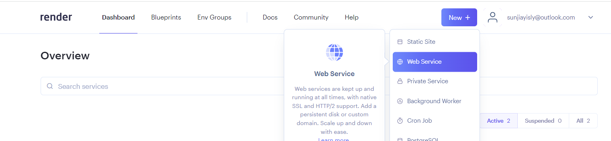

2. To deploy the project, you need to connect to your GitHub repository by selecting "Build and deploy from a Git repository".

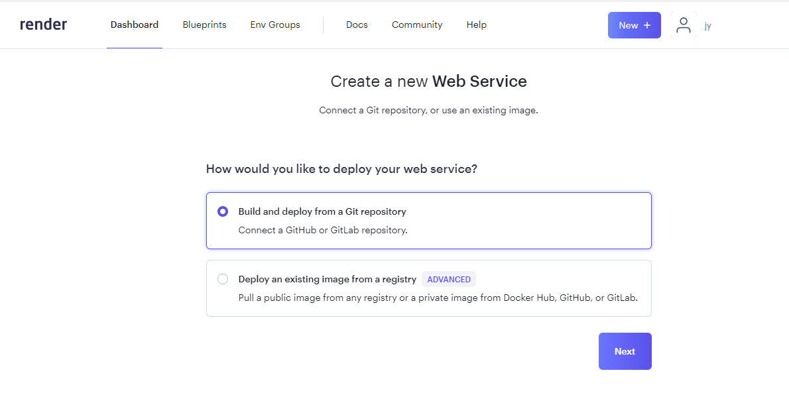

3. Select "connect to GitHub" and authorize Render to access your repositories of choice on GitHub.

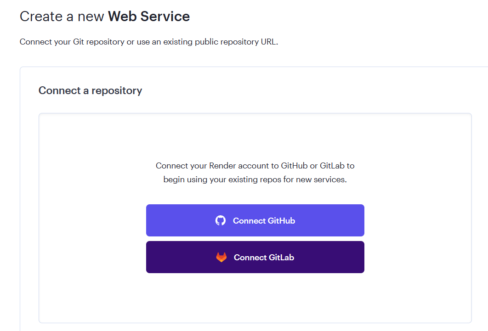

4. Connect the repository you want to deploy to Render.

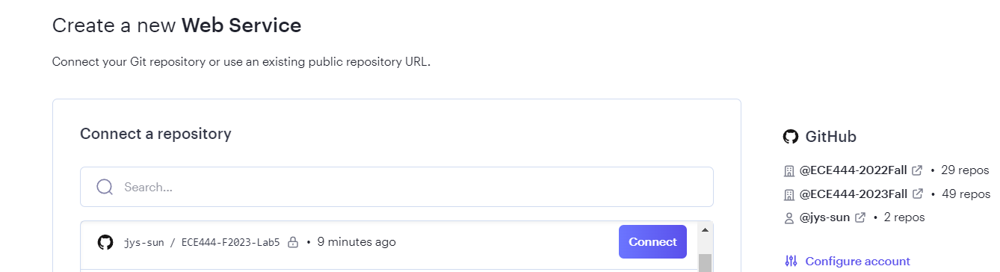

5. In Deployment settings, select the branch you want to deploy. In this case, we will deploy the main branch. Configure the Build command to specify the packages required and the Start command to specify the entry for starting the processes (i.e., app.py in the project for Flaskr-tdd).

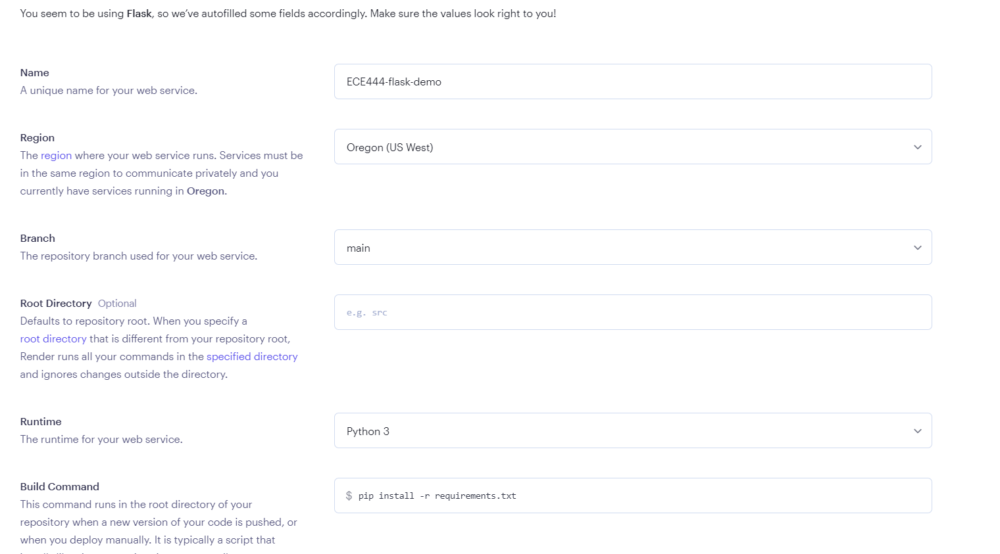

6. Choose the free plan, you can create the web service on Render

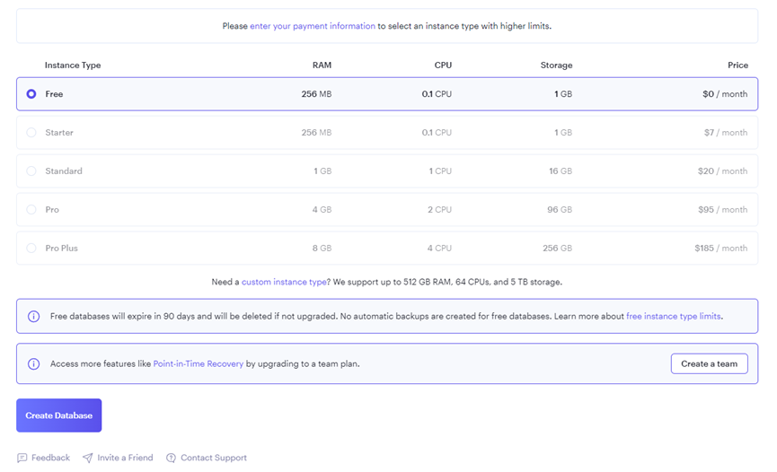

7. Now with the web service created, go to "Environment" to add an environment variable for specifying the Python version. In this case, we will use Python 3.12.0 in Flaskr-tdd project (or the specific Python version you are using for your project)

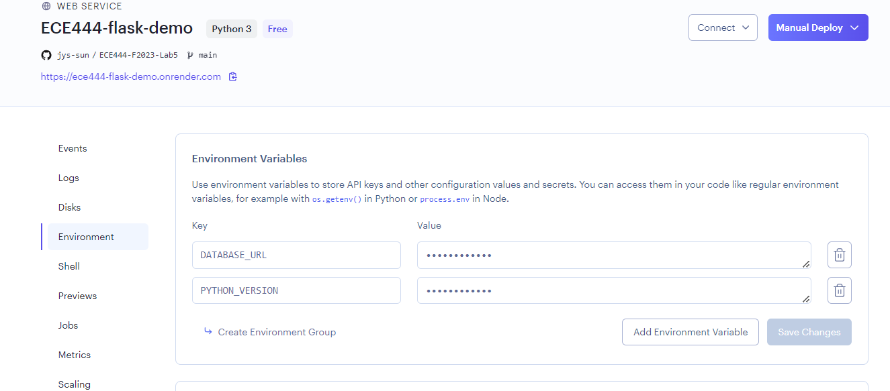

8. The deployment should start automatically. You can check the deployment status in Logs. Once the deployment is completed, you can access the web service by clicking on the URL URL under the project name.

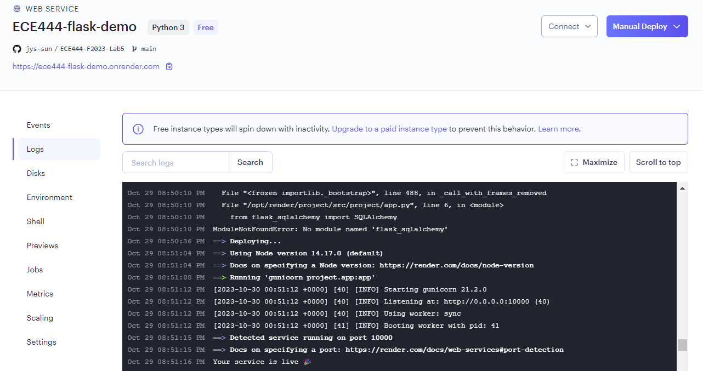
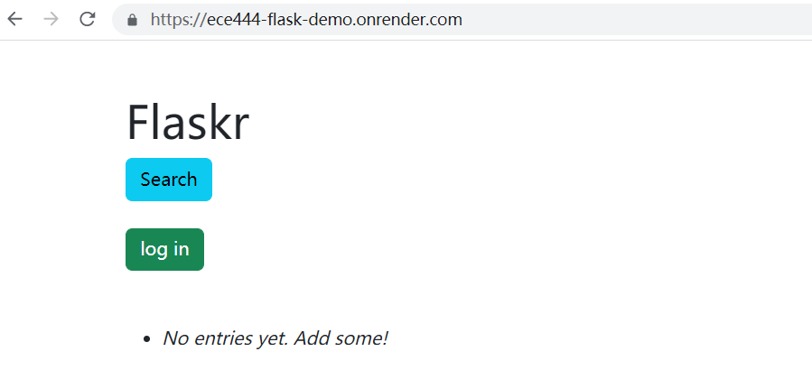


## Bootstrap

Let's update the styles with [Bootstrap](http://getbootstrap.com/).

First, remove the *style.css* stylesheet from both *index.html* and *login.html*. Then add this stylesheet to both files:

```html
<link
  rel="stylesheet"
  type="text/css"
  href="https://cdn.jsdelivr.net/npm/bootstrap@5.3.2/dist/css/bootstrap.min.css"
/>
```

Now, we have full access to all of the Bootstrap helper classes.

Replace the code in *login.html* with:

```html
<!DOCTYPE html>
<html>
  <head>
    <title>Flaskr-TDD | Login</title>
    <link
      rel="stylesheet"
      type="text/css"
      href="https://cdn.jsdelivr.net/npm/bootstrap@5.3.2/dist/css/bootstrap.min.css"
    />
  </head>
  <body>
    <div class="container">
      <br /><br />
      <h1>Flaskr</h1>
      <br /><br />

      
      <div class="flash alert alert-success col-sm-4" role="success">
        {{ message }}
      </div>
      

      <h3>Login</h3>

      
      <p class="alert alert-danger col-sm-4" role="danger">
        <strong>Error:</strong> {{ error }}
      </p>
      

      <form action="{{ url_for('login') }}" method="post" class="form-group">
        <dl>
          <dt>Username:</dt>
          <dd>
            <input
              type="text"
              name="username"
              class="form-control col-sm-4"
            />
          </dd>
          <dt>Password:</dt>
          <dd>
            <input
              type="password"
              name="password"
              class="form-control col-sm-4"
            />
          </dd>
          <br /><br />
          <dd>
            <input type="submit" class="btn btn-primary" value="Login" />
          </dd>
          <span>Use "admin" for username and password</span>
        </dl>
      </form>
    </div>
    <script
      type="text/javascript"
      src="{{url_for('static', filename='main.js') }}"
    ></script>
  </body>
</html>
```

And replace the code in *index.html* with:

```html
<!DOCTYPE html>
<html>
  <head>
    <title>Flaskr</title>
    <link
      rel="stylesheet"
      type="text/css"
      href="https://cdn.jsdelivr.net/npm/bootstrap@5.3.2/dist/css/bootstrap.min.css"
    />
  </head>
  <body>
    <div class="container">
      <br /><br />
      <h1>Flaskr</h1>
      <br /><br />

      
      <a class="btn btn-success" role="button" href="{{ url_for('login') }}"
        >log in</a
      >
      
      <a class="btn btn-warning" role="button" href="{{ url_for('logout') }}"
        >log out</a
      >
      

      <br /><br />

      
      <div class="flash alert alert-success col-sm-4" role="success">
        {{ message }}
      </div>
       
      <form
        action="{{ url_for('add_entry') }}"
        method="post"
        class="add-entry form-group"
      >
        <dl>
          <dt>Title:</dt>
          <dd>
            <input
              type="text"
              size="30"
              name="title"
              class="form-control col-sm-4"
            />
          </dd>
          <dt>Text:</dt>
          <dd>
            <textarea
              name="text"
              rows="5"
              cols="40"
              class="form-control col-sm-4"
            ></textarea>
          </dd>
          <br /><br />
          <dd>
            <input type="submit" class="btn btn-primary" value="Share" />
          </dd>
        </dl>
      </form>
      

      <br />

      <ul class="entries">
        
        <li class="entry">
          <h2 id="{{ entry.id }}">{{ entry.title }}</h2>
          {{ entry.text|safe }}
        </li>
        
        <li><em>No entries yet. Add some!</em></li>
        
      </ul>
    </div>
    <script
      type="text/javascript"
      src="{{url_for('static', filename='main.js') }}"
    ></script>
  </body>
</html>
```

Run the app locally: (Suggested to do <pip install gunicorn> on local VS code terminal before running everything)

```sh
(env)$ FLASK_APP=project/app.py python -m flask run -p 5001
```

Check out the changes in the browser!

## SQLAlchemy

Let's upgrade to [Flask-SQLAlchemy](https://flask-sqlalchemy.palletsprojects.com/), in order to better manage the database.

### Setup

Start by installing Flask-SQLAlchemy:

```sh
(env)$ pip install Flask-SQLAlchemy
```

Make sure to add it to your requirements file as well.

Next, add a *create_db.py* file to the project root. Then, add the following code:

```python
# create_db.py


from project.app import app, db
from project.models import Post


with app.app_context():
    # create the database and the db table
    db.create_all()

    # commit the changes
    db.session.commit()
```

This file will be used to create our new database. Go ahead and delete the old database file (*flaskr.db*) along with the *project/schema.sql* file.

Next, add a *project/models.py* file, which will be used to generate the new schema:

```python
from project.app import db


class Post(db.Model):
    id = db.Column(db.Integer, primary_key=True)
    title = db.Column(db.String, nullable=False)
    text = db.Column(db.String, nullable=False)

    def __init__(self, title, text):
        self.title = title
        self.text = text

    def __repr__(self):
        return f'<title {self.title}>'
```

### Update *app.py*

```python
import sqlite3
from pathlib import Path

from flask import Flask, g, render_template, request, session, \
                  flash, redirect, url_for, abort, jsonify
from flask_sqlalchemy import SQLAlchemy


basedir = Path(__file__).resolve().parent

# configuration
DATABASE = "flaskr.db"
USERNAME = "admin"
PASSWORD = "admin"
SECRET_KEY = "change_me"
SQLALCHEMY_DATABASE_URI = f'sqlite:///{Path(basedir).joinpath(DATABASE)}'
SQLALCHEMY_TRACK_MODIFICATIONS = False


# create and initialize a new Flask app
app = Flask(__name__)
# load the config
app.config.from_object(__name__)
# init sqlalchemy
db = SQLAlchemy(app)

from project import models


@app.route('/')
def index():
    """Searches the database for entries, then displays them."""
    entries = db.session.query(models.Post)
    return render_template('index.html', entries=entries)


@app.route('/add', methods=['POST'])
def add_entry():
    """Adds new post to the database."""
    if not session.get('logged_in'):
        abort(401)
    new_entry = models.Post(request.form['title'], request.form['text'])
    db.session.add(new_entry)
    db.session.commit()
    flash('New entry was successfully posted')
    return redirect(url_for('index'))


@app.route('/login', methods=['GET', 'POST'])
def login():
    """User login/authentication/session management."""
    error = None
    if request.method == 'POST':
        if request.form['username'] != app.config['USERNAME']:
            error = 'Invalid username'
        elif request.form['password'] != app.config['PASSWORD']:
            error = 'Invalid password'
        else:
            session['logged_in'] = True
            flash('You were logged in')
            return redirect(url_for('index'))
    return render_template('login.html', error=error)


@app.route('/logout')
def logout():
    """User logout/authentication/session management."""
    session.pop('logged_in', None)
    flash('You were logged out')
    return redirect(url_for('index'))


@app.route('/delete/<int:post_id>', methods=['GET'])
def delete_entry(post_id):
    """Deletes post from database."""
    result = {'status': 0, 'message': 'Error'}
    try:
        db.session.query(models.Post).filter_by(id=post_id).delete()
        db.session.commit()
        result = {'status': 1, 'message': "Post Deleted"}
        flash('The entry was deleted.')
    except Exception as e:
        result = {'status': 0, 'message': repr(e)}
    return jsonify(result)


if __name__ == "__main__":
    app.run()
```

Notice the changes in the config at the top as well since the means in which we're now accessing and manipulating the database in each view function -- via SQLAlchemy instead of vanilla SQL.

### Create the DB

Run the following command to create the initial database:

```sh
(env)$ python create_db.py
```

### Tests

Finally, update the `client` fixture in the tests:

```python
@pytest.fixture
def client():
    BASE_DIR = Path(__file__).resolve().parent.parent
    app.config["TESTING"] = True
    app.config["DATABASE"] = BASE_DIR.joinpath(TEST_DB)
    app.config["SQLALCHEMY_DATABASE_URI"] = f"sqlite:///{BASE_DIR.joinpath(TEST_DB)}"

    with app.app_context():
        db.create_all()  # setup
        yield app.test_client()  # tests run here
        db.drop_all()  # teardown
```

Update the imports as well:

```python
from project.app import app, db
```

Ensure the tests pass:

```sh
(env)$ python -m pytest

=============================== test session starts ===============================
platform darwin -- Python 3.10.4, pytest-7.4.2, pluggy-1.0.0
rootdir: /Users/michael/repos/github/flaskr-tdd
collected 6 items

tests/app_test.py ......                                                    [100%]

================================ 6 passed in 0.34s ================================
```

Manually test the app as well by running the server and logging in and out, adding new entries, and deleting old entries.

If all is well, Update the requirements file:

```
Flask
Flask-SQLAlchemy
gunicorn
pytest
```

Commit your code, and then push to GitHub!

## Search Page

Let's add a search page. It will be a nice feature that will come in handy after we have a number of posts.

### Update *app.py*

```python
@app.route('/search/', methods=['GET'])
def search():
    query = request.args.get("query")
    entries = db.session.query(models.Post)
    if query:
        return render_template('search.html', entries=entries, query=query)
    return render_template('search.html')
```

> Be sure to write a test for this on your own!

### Own After writing the test for Search do the following 4 commands:
first delete flaskr.db

python -m pytest 

python create_db.py 

FLASK_APP=project/app.py python -m flask run -p 5001

### Add *search.html*

In the "templates" folder create a new file called *search.html*:

```sh
(env)$ touch search.html
```

Now add the following code to *search.html*:

```html
<!DOCTYPE html>
<html>
  <head>
    <title>Flaskr</title>
    <link
      rel="stylesheet"
      type="text/css"
      href="https://cdn.jsdelivr.net/npm/bootstrap@5.3.2/dist/css/bootstrap.min.css"
    />
  </head>
  <body>
    <div class="container">
      <br /><br />
      <h1>Flaskr</h1>
      <br /><br />

      <a class="btn btn-primary" role="button" href="{{ url_for('index') }}">
        Home
      </a>

      
      <a class="btn btn-success" role="button" href="{{ url_for('login') }}"
        >log in</a
      >
      
      <a class="btn btn-warning" role="button" href="{{ url_for('logout') }}"
        >log out</a
      >
      

      <br /><br />

      
      <div class="flash alert alert-success col-sm-4" role="success">
        {{ message }}
      </div>
      

      <form action="{{ url_for('search') }}" method="get" class="from-group">
        <dl>
          <dt>Search:</dt>
          <dd>
            <input type="text" name="query" class="form-control col-sm-4" />
          </dd>
          <br />
          <dd><input type="submit" class="btn btn-info" value="Search" /></dd>
        </dl>
      </form>

      <ul class="entries">
         
        <li class="entry">
          <h2 id="{{ entry.post_id }}">{{ entry.title }}</h2>
          {{ entry.text|safe }}
        </li>
         
      </ul>
    </div>
    <script
      type="text/javascript"
      src="{{url_for('static', filename='main.js') }}"
    ></script>
  </body>
</html>
```

### Update *index.html*

Add a search button for better navigation just below `<h1>Flaskr</h1>`:

```html
<a class="btn btn-info" role="button" href="{{ url_for('search') }}">Search</a>
```

Test it out locally. If all is well, commit your code and push to GitHub.

## Login Required

Currently, posts can be deleted by anyone. Let's change that so one has to be logged in before they can delete a post.

Add the following decorator to *app.py*:

```python
def login_required(f):
    @wraps(f)
    def decorated_function(*args, **kwargs):
        if not session.get('logged_in'):
            flash('Please log in.')
            return jsonify({'status': 0, 'message': 'Please log in.'}), 401
        return f(*args, **kwargs)
    return decorated_function
```

Don't forget the import:

```python
from functools import wraps
```

> Be sure to write tests for this on your own!

Next, add the decorator to the `delete_entry` view:

```python
@app.route('/delete/<int:post_id>', methods=['GET'])
@login_required
def delete_entry(post_id):
    """Deletes post from database."""
    result = {'status': 0, 'message': 'Error'}
    try:
        new_id = post_id
        db.session.query(models.Post).filter_by(id=new_id).delete()
        db.session.commit()
        result = {'status': 1, 'message': "Post Deleted"}
        flash('The entry was deleted.')
    except Exception as e:
        result = {'status': 0, 'message': repr(e)}
    return jsonify(result)
```

Update the test:

```python
def test_delete_message(client):
    """Ensure the messages are being deleted"""
    rv = client.get("/delete/1")
    data = json.loads(rv.data)
    assert data["status"] == 0
    login(client, app.config["USERNAME"], app.config["PASSWORD"])
    rv = client.get("/delete/1")
    data = json.loads(rv.data)
    assert data["status"] == 1
```

Test it out locally again. If all is well, commit your code and push to GitHub.

## Postgres Database on Render 
### Set up the database
1. For deployment on Render, we can use [Postgres](https://www.postgresql.org/), which is a production grade database. Render offers Postgres database hosting service for 90 days for free. We will use the Postgres database to store the data for the Flaskr-tdd project.

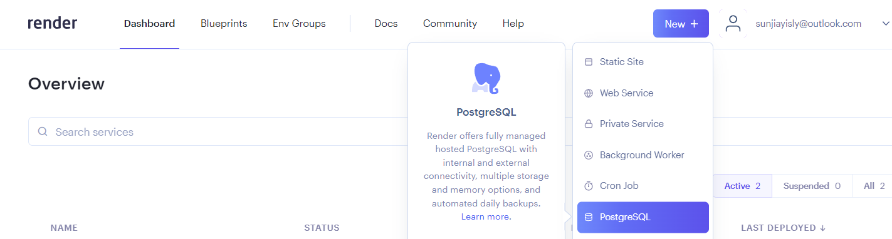

2. Enter the Name for the Postgres instance and database

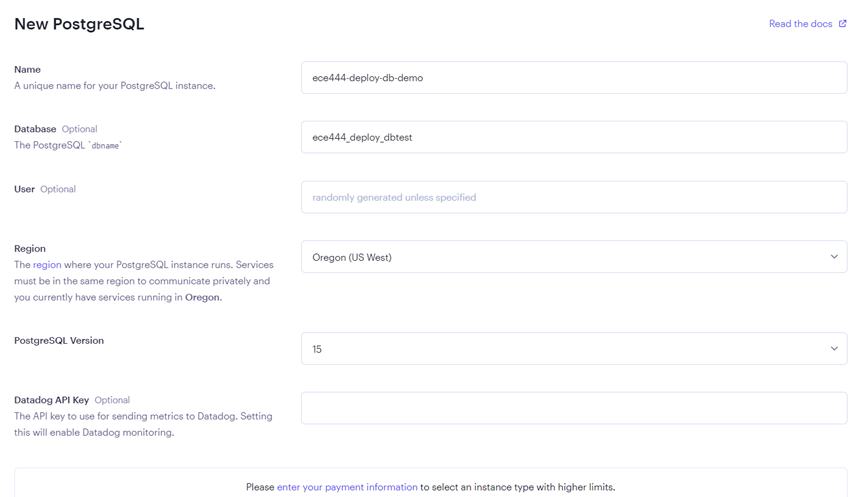

3. Select the free plan and create the database


4. Now you have a Postgres database on Render.

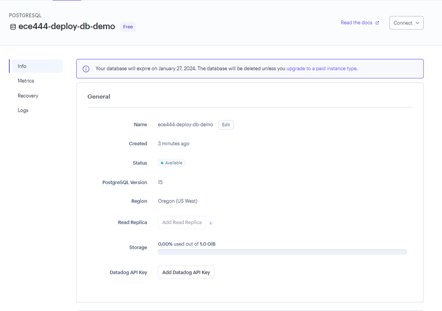

5. Copy the External Database URL and Internal Database URL for later use

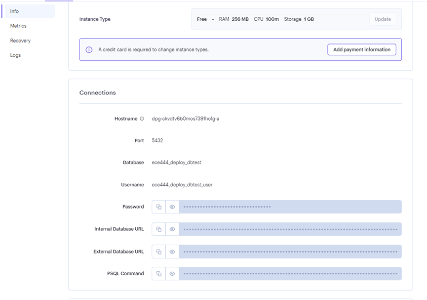

### Connect the database to the Flaskr-tdd project 
1. To use the Postgres database, we need to update the app.py file in the Flaskr-tdd project. In the app.py file, update the SQLALCHEMY_DATABASE_URI variable to use the value of the DATABASE_URL environment variable if it's available. Otherwise, it will use the SQLite URL. (Important Note: Make sure to import os in the app.py file)

```python
url = os.getenv('DATABASE_URL', f'sqlite:///{Path(basedir).joinpath(DATABASE)}')

if url.startswith("postgres://"):
    url = url.replace("postgres://", "postgresql://", 1)

SQLALCHEMY_DATABASE_URI = url
```

2. Set up the DATABASE_URL locally to create the tables in the Postgres database. We will be using the external database URL in the previous steps for connecting and creating tables in the remote database on Render.

```sh
$env:DATABASE_URL="the value of the external database URL you copied earlier"
```

3. With the DATABASE_URL set, run db.create_all() locally to create the tables in the Postgres database.
   
   ### Own: Do the following commands to create the tables and run the test (Step 3 & 4)
   
   -Make sure you are in the project folder not flaskr-tdd.
   
   (env) tasfiaislam@Tasfias-MBP ~/Desktop/ECE444/Labs/Lab3/Lab3vscode/flaskr-tdd % **cd project**
   
   (env) tasfiaislam@Tasfias-MBP ~/Desktop/ECE444/Labs/Lab3/Lab3vscode/flaskr-tdd/project % **flask shell**

Python 3.12.1 (v3.12.1:2305ca5144, Dec  7 2023, 17:23:38) [Clang 13.0.0 (clang-1300.0.29.30)] on darwin
App: project.app

Instance: /Users/tasfiaislam/Desktop/ECE444/Labs/Lab3/Lab3vscode/flaskr-tdd/instance

>>> db.create_all()

>>> exit()

(env) tasfiaislam@Tasfias-MBP ~/Desktop/ECE444/Labs/Lab3/Lab3vscode/flaskr-tdd/project % **cd ~/Desktop/ECE444/Labs/Lab3/Lab3vscode/flaskr-tdd**

(env) tasfiaislam@Tasfias-MBP ~/Desktop/ECE444/Labs/Lab3/Lab3vscode/flaskr-tdd % **python -m pytest**

======================================== test session starts =========================================
platform darwin -- Python 3.12.1, pytest-8.3.3, pluggy-1.5.0

collected 7 items                                                                                    

tests/app_test.py .......                                                                      [100%]

========================================= 7 passed in 0.40s ==========================================

(env) tasfiaislam@Tasfias-MBP ~/Desktop/ECE444/Labs/Lab3/Lab3vscode/flaskr-tdd % **python create_db.py **                                

Testing: Database and tables created successfully!
Dummy post added to the Post table!

(env) tasfiaislam@Tasfias-MBP ~/Desktop/ECE444/Labs/Lab3/Lab3vscode/flaskr-tdd % **FLASK_APP=project/app.py python -m flask run -p 5001**


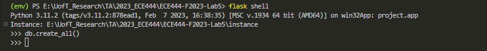

1. Run the tests to ensure they still pass locally.
2. Commit and push your code to the GitHub
3. Go to the Render dashboard. We need to set up the database for the Flaskr-tdd project. In your web service settings on Render for the application, create an environment variable named DATABASE_URL and set its value to the Internal Database URL saved in the previous step.


**Own:** To avoid the post error in Rendor app, set the starter command of Render by going settings of the web app and setting start 
command to: 
<python create_db.py; gunicorn project.app:app>

7. The deployment should start automatically upon a new commit. Once the deployment is completed, you can access the web service by clicking on the URL under the project name.

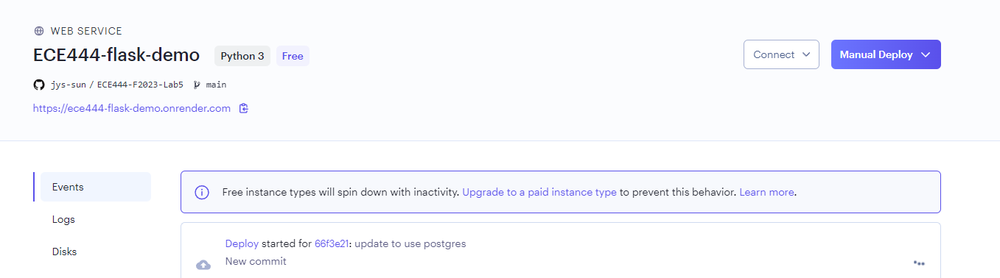

## Linting and Code Formatting

Finally, we can lint and auto format our code with [Flake8](http://flake8.pycqa.org/) and [Black](https://black.readthedocs.io/), respectively:

```sh
(env)$ pip install flake8
(env)$ pip install black
```

Run Flake8 and correct any issues:

```sh
(env)$ python -m flake8 --exclude env --ignore E402,E501 .

./create_db.py:5:1: F401 'project.models.Post' imported but unused
./tests/app_test.py:2:1: F401 'os' imported but unused
./project/app.py:2:1: F401 'sqlite3' imported but unused
./project/app.py:6:1: F401 'flask.g' imported but unused
./project/app.py:7:19: E126 continuation line over-indented for hanging indent
```

Update the code formatting per Black:

```sh
$ python -m black --exclude=env .

reformatted /Users/michael/repos/github/flaskr-tdd/project/models.py
reformatted /Users/michael/repos/github/flaskr-tdd/project/app.py
All done! ✨ 🍰 ✨
2 files reformatted, 4 files left unchanged.
```

Test everything out once last time!


# Complemtary materials:
As many of you know, Flaskr -- a mini-blog-like-app -- is the app that you build for the official Flask [tutorial](https://flask.palletsprojects.com/en/3.0.x/tutorial/). I've gone through the tutorial more times than I care to admit. Anyway, I wanted to take the tutorial a step further by adding [Test-Driven Development](https://testdriven.io/test-driven-development/) (TDD), a bit of JavaScript, and deployment. This article is that tutorial. Enjoy.

Also, if you're completely new to Flask and/or web development in general, it's important to grasp these basic fundamental concepts:

1. The difference between HTTP GET and POST requests and how functions within the app handle each.
1. What HTTP "requests" and "responses" are.
1. How HTML pages are rendered and/or returned to the end user.
